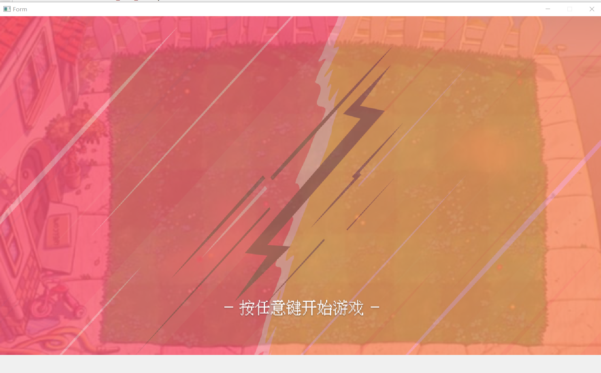
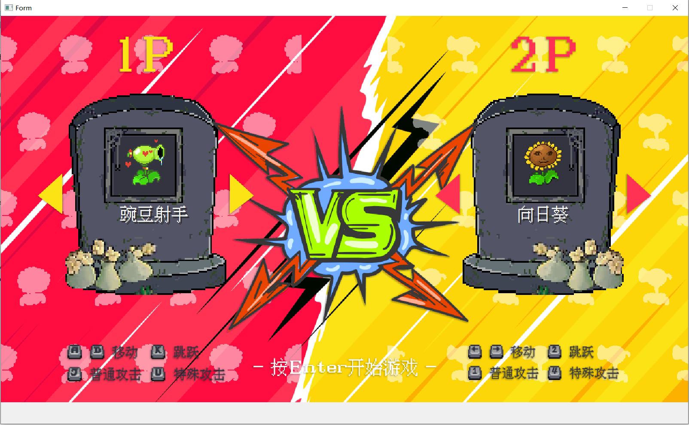
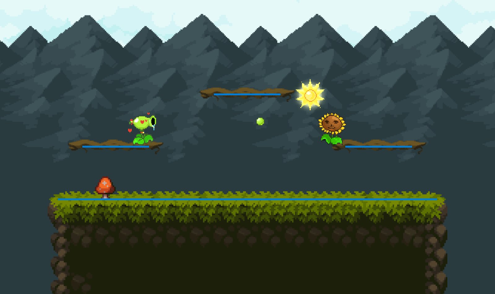
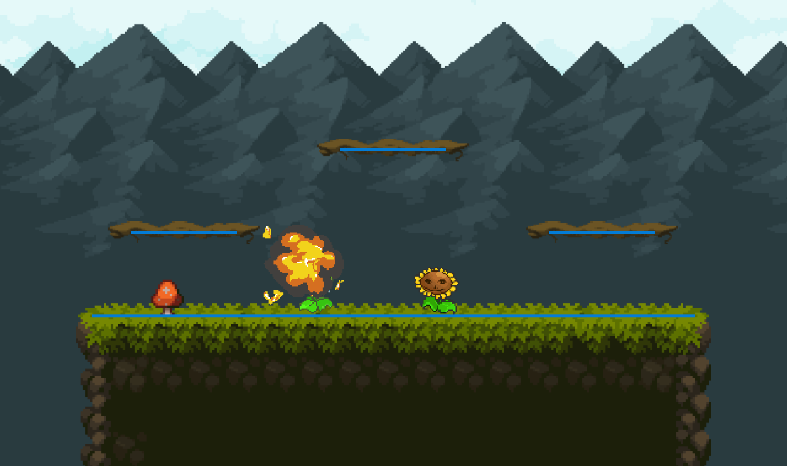

# 声明

本人非计算机专业学生，代码水平有限，代码仅供参考。代码和素材参考了B站up主@voidmatrix。

代码开发平台选择了Qt creator 12.0.0(community)，构建套件为Qt 6.6.1 MSVC2019 64bit，开发时未考虑不同Qt版本与编译器兼容性，仅作参考。

# 目前已实现功能

## 游戏启动界面

1. 播放背景音乐
2. 按下任意键切换到角色选择界面（不要按回车键，目前存在bug懒得修复，这会导致直接跳过用户选择界面）

## 角色选择界面

1. 按下左右键能够选择角色，按下确认键后进入战斗界面
2. 动态背景及角色动画的实现。背景中的阴影始终呈现对手角色。
3. 切换角色播放切换的音乐

## 战斗界面

1. 构建战斗平台
2. 实现两个角色的跑步和静态动画播放
3. 实现移动及跳跃功能
4. 实现重力及碰撞效果
5. 实现发射子弹和子弹碰撞识别功能
6. 实现豌豆射手和向日葵的技能释放

# 最后

代码更新频率全看心情，由于近期沉迷于黑神话悟空，难免降低代码更新速度，望见谅。